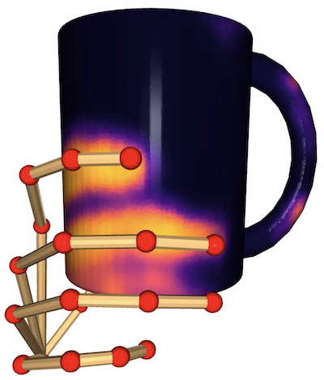

# [ContactPose](https://contactpose.cc.gatech.edu)

Hand-object contact modeling with **skeleton** features. Implemented
in [PyTorch](https://pytorch.org).

## Getting Started

1. Follow [these steps](https://github.com/samarth-robo/ContactPose-ML/tree/master#getting-started).
2. If you haven't already, download data from the [ContactPose dataset API](https://github.com/facebookresearch/ContactPose).
You only need the *grasps data* for these ML experiments.
```
$ cd <API_CLONE_DIR>
$ conda activate contactpose
$ python scripts/download_data.py --type grasps
```
This will download to `<API_CLONE_DIR>/data/contactpose_data`.

3. Download the trained PyTorch models and necessary data:
```bash
$ python get_data.py --contactpose_data_dir <API_CLONE_DIR>/data/contactpose_data 
```

## Demo
Coming soon

## Inference
For example, evaluate the PointNet++ model trained on the `objects` split,
and show the result:
```bash
$ python eval.py --show_object \
    --split objects \
    --config configs/pointnet.ini \
    --checkpoint data/pointnet_split_objects_skeleton/checkpoint_model_145_train_loss=1.359683.pth
```
`--split` can be `objects` or `participants`,
`--config` can be `data/mlp.ini`, `data/pointnet.ini`, or `data/voxnet.ini` according
to the learner model architecture, and the `--checkpoint` will change accordingly.


If you want to check the output for a specific grasp, change `include_sessions`,
`include_instructions`, and `include_objects` of `split_overfit['test']` in 
`train_test_splits.py`, and then use `overfit` as the split for `eval.py`.

To re-produce the AuC results from the paper:
- Evaluate the entire test split:
```bash
$ ./eval_script.sh configs/pointnet.ini objects \
    data/pointnet_split_objects_skeleton/checkpoint_model_145_train_loss=1.359683.pth 0
```
This produces pickle files named `predictions_*_runN.pkl` in the same directory
as the checkpoint. They contain the raw softmax predictions.
- Run `process_predictions.sh data/checkpoints`. The `exp` variable in that 
script corresponds to directory names in `data/checkpoints`, so modify that
according to the names of the experiments you want to process predictions for.
This runs the "annealed mean", calculates the re-balanced AuC value, statisitics,
and stores them in `results.json` in the same directory.

## Training
For example, train the MLP model on the `participants` split:

(in a separate terminal)
```bash
$ conda activate contactpose_ml
$ visdom env_path=data/checkpoints
```

(in a separate terminal)
```bash
$ conda activate contactpose_ml 
$ python train_val.py --split participants --config configs/mlp.ini
```
As before, you can change `--split` and `--config` to select your split/learner
architecture combination. The script also has support for visualizing
progress with `visdom`, logging to a txt file, and resuming optimization
from a checkpoint.
